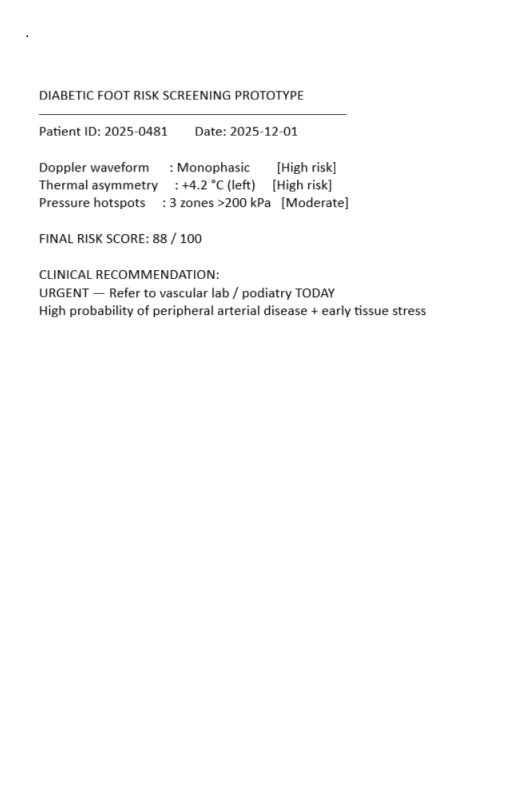

# Diabetic Foot Ulcer (DFU) Risk Screening Prototype

**Early-detection mobile tool for diabetic patients & clinicians**  
Combines three evidence-based modalities into a single 0–100 risk score with clinical alerts.

### Features
- Doppler waveform classification from phone microphone (triphasic / biphasic / monophasic)  
- Thermal asymmetry detection from foot photos (OpenCV)  
- Pressure hotspot simulation (Orpyx-style insole proxy)  
- Final risk score + tiered clinical recommendations  
- CSV export for telemedicine / EHR integration

**Status**: Functional prototype — successfully classifies Doppler audio and thermal images.  
Predevelopment during clinical work in DFU at Aseer Central Hospital (2020) 

### Live Demo

Technologies: Python • Jupyter • OpenCV • Librosa • NumPy • Medical signal & image processing

### Example Output

> **URGENT** – Risk Score: 88/100  
> Monophasic Doppler + 4.2°C thermal asymmetry detected → Refer to vascular lab TODAY
